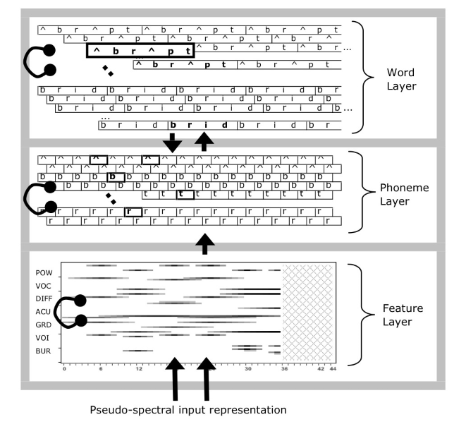
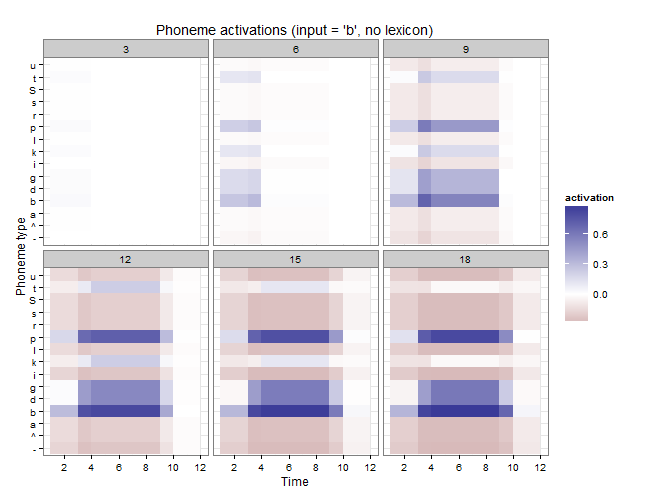
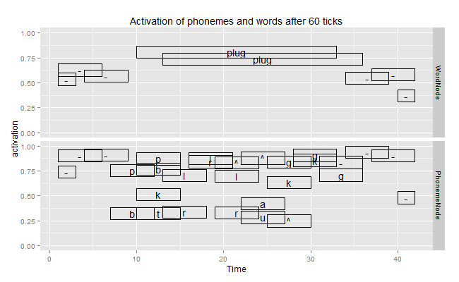
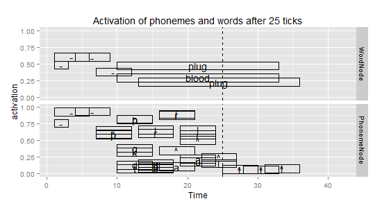
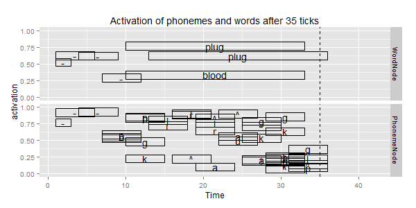
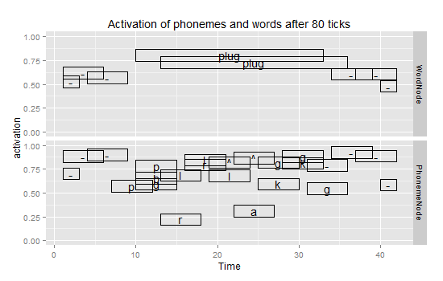

---
title: 'retrace: An implementation of TRACE in R'
author: "Tristan Mahr"
date: "December 18, 2014"
output: 
  rmarkdown::html_vignette:
    keep_md: yes
vignette: >
  %\VignetteIndexEntry{Vignette Title}
  %\VignetteEngine{knitr::rmarkdown}
  \usepackage[utf8]{inputenc}
...

```{r, echo = FALSE}
library("knitr")
opts_chunk$set(
  comment = "#>",
  error = FALSE,
  tidy = FALSE, 
  echo = FALSE)
```

```{r, message = FALSE, warning = FALSE}
library("retrace")
library("ggplot2")
library("magrittr")
library("dplyr")
```


## Abstract

The TRACE model (McClelland & Elman, 1986) applies a connectionist architecture
to the problem of recognizing words in a stream of speech. The model has proven
very successful, and it's still relevant 28 years later. In this report, I
describe and demonstrate `retrace`, an implementation of the TRACE model written
in the R programming language. I begin by discussing why word recognition is an
interesting problem and how two different TRACE models have tackled this
problem. After a high-level overview of the model's architecture, I discuss the
model from the ground-up. First, I describe the mock-speech that acts as the
input into the model. Next, I describe nodes as bundles of data that pass
messages back and forth. I demonstrate how activation propagates using this
simple example. Finally, I provide three demonstrations of the model's behavior
when on some speech input, showing 1) that feature values activate phoneme
units, 2) that phoneme units activate word units, 3) that top-down
word-to-phoneme pathways allows the network to interpret ambiguous speech sounds
(the Ganong effect).

**Note**: I originally developed this R package and wrote this report as a final
project in a psychology course on parallel distributed processing.

## Word Recognition

Poor Taylor Swift. Everyone [keeps mishearing][swift] her recent single, "Blank
Space". The lyrics read "long list of ex-lovers", but we just hear "lonely
Starbucks lovers". Swift's misheard lyrics are a clear example of how word
recognition is an interesting problem.

[swift]: http://nymag.com/scienceofus/2014/11/why-you-keep-mishearing-that-taylor-swift-lyric.html

Fluent speech comes in a continuous stream of overlapping sounds. There is no
punctuation. Sounds vary tremendously based on word position, neighboring
sounds, and prosodic environment--not to mention that speakers vary or that we
have perceive speech in noisy environments (and during pop songs). What's a
speaker to do in the face of such variability? What's an *artificial neural
network* to do?

How do we recover a linguistic signal buried in all that variability? In the
first exposition of a TRACE-like model, Elman and McClelland (1986) offer one
strategy based on a bottom-up approach:

> The 'lack-of-invariance problem' is not a problem at all for human listeners.
It is precisely the variability in the signal which permits listeners to
understand speech in a variety of contexts, spoken by a variety of speakers.
Instead of searching for invariance in the signal, we think it makes more sense
to try to understand how it is that listeners deal with the variability which is
there" (p.360).

In this model, acoustic feature detectors activate phoneme representations which
in turn activate lexical representations. Rather than trying to pluck out
perceptual invariants in the signal, the system permits a many-to-one mapping
between feature patterns and phonemes. That is, different features patterns can
activate the same phoneme---which is appropriate because phonemes vary
contextually. To use one of their examples, the /b/ sounds in *ball* and *crib*
are acoustically different, but recognized as the same sound. (p.367). Of
course, this property of speech cuts both ways, as two acoustically similar
tokens can be perceived as categorically distinct sounds.

The TRACE 1.0 model argues that feature-rich representations can support word
recognition by turning the lack-of-invariance problem on its head. Such an
approach is powerful but ultimately insufficient. Some top-down pressure is
necessary to prevent "recognize speech" from being wrongly parsed as the
improbable "wreck a nice beach". The authors admit as much and foreshadow their
exploration of the top-down effects: "In a forthcoming paper, we show how the
simulated speech version of the TRACE model can identify words and use
word-level activations to bias phoneme-level activations" (p.379). They are
referring, of course, to TRACE 2.0 (McClelland and Elman, 1986)--this is the
model that is most commonly referred to as *the* TRACE model, and it's the focus
of this report.

Both TRACE models use similar architectures: Speech enters the model in
successive time slices. In each time slice, a bank of feature detectors responds
to the features in the signal. These feature detectors, when activated by the
input, excite compatible phoneme nodes which in turn excite compatible word
units. Both models rely on principles of interactive activation: Compatible
units reciprocally excite one another, and incompatible units reciprocally
inhibit each other.

Where these two models differ is in their research questions and the
implementation details needed to answer those questions. The TRACE 1.0 model
bases its feature representations on real acoustic measurements in order to
offer a psychologically plausible solution to a difficult engineering problem.
The TRACE 2.0 model abstracts away from the acoustic details, using
"mock-speech" and mock features. This model has been tremendously successful,
and it's still relevant and regularly cited today---thanks to the finding that
TRACE simulations provide a close approximation of looking patterns in some
eye-tracking tasks (Allopenna, Magnuson, & Tanenhaus, 1998).

Although this report is focused on the second TRACE model (and the more
tractable mock-speech inputs it interpret), both TRACE models are concerned with
the integration of acoustic cues over time during speech perception and word
recognition. It is the interaction of both kinds of information---top-down and
bottom-up channels, each operating on different time scales---that makes word
recognition such an interesting problem.

## High-level description of the TRACE architecture

The TRACE model is simple schematically---just *three* layers of units---but
it's massive in scale. A simple simulation will involve thousands of paths
between nodes. I will start with a basic overview:

- **Problem**: Recognize sounds and word (from a pool of competing alternatives)
from an acoustic signal.
- **Input**: A mock-speech spectrogram. The input signal represents acoustic
features in equally sized chunks of time. Each time slice contains values for
different feature spectra (voicing, power, etc.). The input arrives in the model
one slice at time.
- **Feature Detectors**: For each feature spectrum and in each time slice, 
there's a bank of nodes that responds to the values of that feature in the input
signal. This bank forms a *feature detector*. The nodes in the detector compete 
with each other, so there are mutually inhibitory connections among the nodes in
a feature detector. (Only nodes within the same feature detector inhibit each 
other.)
- **Feature-to-Phoneme Connections**: Phoneme units span over multiple time
slices and hence over multiple feature detectors. Excitatory connections run
from the feature nodes to compatible phoneme units. These connections allow the
model to abstract away from fine-grained input data to a coarser phoneme-level
interpretation of the input signal.
- **Phoneme Layer**: Phoneme units are repeated and interleaved over the course
of input signal. For example, there is a /p/ unit for each of the time-slice
intervals 1--3, 1--6, 4--9, 7--12, 10--16, 13--18, etc.
- **Phoneme-to-Phoneme Connections**: Phonemes units compete with each other if
they overlap in time, and inhibitory connections run between competing phonemes.
The strength of the inhibitory connection is proportional to the degree overlap
between the phonemes. Phonemes that fully overlap are have strong inhibitory
connections, whereas phonemes that partially overlap have a weaker inhibitory
connection.
- **Word Layer**: Word units span the width their constituent phonemes, so that
a word with four phonemes spans over just as many time slices as four successive
phonemes. Like phoneme units, they are repeated and interleaved over the course
of the signal.
- **Phoneme-to-Word, Word-to-Phoneme Connections**: A phoneme unit excites a
word unit if 1) it overlaps in time with the word and 2) the word contains the
phoneme. A word unit also excites phoneme units under the same conditions. (Note
that this word-to-phoneme is the only top-down pathway in the model
architecture, despite some descriptions of TRACE.)
- **Word-to-Word Connections:** Word units compete with each other if they
overlap in time, just as phonemes do. Inhibitory connections extend between
competing word units, and the strength of the inhibitory connection increases as
the overlap between competing units increases.
- **Computation Summary**: Mock speech input arrives in successive time slices.
Feature detectors respond to the feature values in each slice. The feature
detectors excite phonemes when the feature-value is compatible with that
phoneme. Phonemes in turn activate compatible word units and word units
reciprocally reinforce phoneme units. Competing units in each layer of units
compete with each other and inhibit one another. The network processes the input
one slice at time. The network continues to run for some number of processing
cycles after the input has finished, so the nodes can continue to excite,
inhibit and reinforce each other. At each processing cycle, the model's
interpretation of the input signal is determined by the feature, phoneme and
word units with the strongest activation values at various points in time.

Below is a schematic of the network structure, created for the jTRACE
implementation (Strauss, Harris, & Magnuson, 2007). Arrows between layers
represent excitatory pathways; the looped edge in each layer represents that
competing nodes are mutually inhibitory within each layer.



Note that phoneme and word units are repeated and interleaved in those layers.
The word layer in the figure shows the word units for two lexical
items---*abrupt* and *breed*---but these words are repeated over several
overlapping sub-layers. These layers extend horizontally to match the temporal
length of the input signal, so longer streams require more phoneme and word
units. These expanding layers cause the network to grow in very large in scale.

## Input Representation

Model input is an idealized kind of acoustic signal. Words are made up of
phonemes, phonemes are made up of acoustic features spread out over time, and
phonemes overlap with each other. The signal fed into the model consists are the
values of the features at different slices of time.

### Features

There are seven different feature types: Power, Acute, Diffuse, Consonantal,
Vocalic, Voiced, and Burst. (The TRACE 1.0 model defines a similar set of
features in terms of measurable acoustic properties of the speech signal, so
these features are perceptually plausible.) There are eight possible values for
these features, plus a special zero value used to represent silence. We
interpret the features as perceptual continua, and we interpret the eight values
within each feature as octiles along that continuum. Consider the Vocalic
Feature. We suppose that this feature reflects some perceptual continuum (having
to do with the resonance of a sound), so the feature values Vocalic1 through
Vocalic8 carve up that continuum into eight receptive fields. The highly
resonant sounds in the input (namely, vowels) correspond with higher feature
values along this continuum.

### Features over Time

Because sounds overlap with each other, the feature values in the input also
overlap with each other. The model captures this property of speech by spreading
out the feature values of each sound over 11 time slices. For example, in a
fully voiced sound, the Voiced feature will have an extreme value on that
continuum, Voiced8. The Voiced8 feature-value is spread over 11 time slices. The
magnitude of the Voiced8 feature-value will rise over five slices, reach its
peak value, and decrease over another five slices. In terms of
percentage-of-peak energy, the 11 values for the value are as follows: [17%,
33%, 50%, 67%, 83%, 100%, 83%, 67%, 5%, 33%, 17%].

These graded, temporally distributed feature values allow sounds in the input
signal to overlap with each other. Suppose we have two sounds /t/ and /a/. The
feature values of /t/ are spread over 11 time slices with its peak feature
magnitudes landing on the time slice 6. Once the features of /t/ begin to
decrease on slice 7, the features of /a/ begin to increase simultaneously. /a/
achieves its peak feature values on slice 12. These overlapping feature
gradients are sketched below:

| Time | 1   | 2   | 3   | 4   | 5   | 6    | 7   | 8   | 9   | 10  | 11  | 12   | 13  | 14  | 15  | 16  | 17  |
|------|-----|-----|-----|-----|-----|------|-----|-----|-----|-----|-----|------|-----|-----|-----|-----|-----|
| /t/  | 17% | 33% | 50% | 67% | 83% | 100% | 83% | 66% | 50% | 33% | 17% |      |     |     |     |     |     |
| /a/  |     |     |     |     |     |      | 17% | 33% | 50% | 67% | 83% | 100% | 83% | 66% | 50% | 33% | 17% |

Although each sound has feature information distributed over 11 time slices, the
two sounds together only take up 17 time slices. This representational scheme
provides the model with an idealized form of coarticulation because the
temporal-spectral of each sound is conditioned by its neighboring sounds.

### Visual Example of Model Input

Let's look at an example of the model's pseudo-spectral representation of the
speech signal. Below is the input form of "…blush…". I noted in passing that
silence is modeled with a special zero feature value. Words fed into the model
begin and end with silence, so the feature values below reflect six sound units
/-bl^S-/. Each facet in the plot corresponds to a different acoustic feature,
the y axis reflects the 8 different regions along the feature continua, and the
x axis is time in the signal, and the size of point reflects the magnitude of
the feature value. The silence features are obvious: They are the only values
that occur "off" the continua at y = 0, and they occur at the beginning and end
of the word. The diamond shape of the feature magnitudes for the silences
reflect how features rise from nothing, hit their peak, and fall back to zero.

```{r blush, fig.cap = "Feature representation of _blush_", fig.width=8, fig.height=6}
blush <- create_input_matrix("bl^S")
plot_feature_input(blush) + ggtitle("Feature representation of 'blush'")
```

More interestingly, consider the Voiced feature. Both the /l/ and the /^/ in the
center of the word are fully voiced. These sounds are adjacent and overlapping.
The decrease values of Voiced8 in /l/ co-occur with the rising values in /^/.
These values are complementary so that the feature reaches 100% intensity over
several time slices.

In acoustic phonetics, the most common way to visualize speech is with a
spectrogram in which the signal is drawn with time on the x axis, frequency on
the y axis and intensity represented on a z axis. Note that these feature
representations are also three-dimensional: time on the x axis, feature degree
on the y axis, and magnitude or intensity in the z (size) axis. In this respect,
the model represents speech using an idealized but plausible spectro-temporal
representation.

## Implementation overview

At this point, we're ready to look at `retrace`, my implementation of TRACE in
the R programming language. We begin with some simple communication between
nodes.

### Nodes

Nodes are implemented using a message-passing object-oriented paradigm. What
this means that is that the nodes of the network are just capsules of data plus
methods for manipulating that data. Each node knows about its current activation
level, can collect input from other nodes and can update its current activation
state. More explicitly, each node has following attributes (among other
convenient attributes like a label or a history of activation values).

| **Attribute**                                 | **Description**                                                                                              |
|-----------------------------------------------|--------------------------------------------------------------------------------------------------------------|
| `timeslices`, `t_start`, `t_end`              | Where in the speech time-stream the node occurs.                                                             |
| `edges_in`                                    | A list of incoming edges. Each edge is just a weight and a reference to the sending node.                    |
| `act_min`, `act_max`, `act_rest`, `act_decay` | Activation parameters. Activation bounds are [-.3, 1] with a resting value of 0 and default decay rate of 0. |
| `tick`                                        | Number previous updates.                                                                                     |
| `cache`                                       | Most recent input value.                                                                                     |
| `activation`                                  | Current level of activation                                                                                  |

Time is represented spatially in the network, so the `timeslices` attributes
describe the spatial arrangement of the node and allows us to determine whether
nodes overlap in time.

The following methods describe the basic operations of a node:

| **Methods**            |  **Description**                                    |
|------------------------|-----------------------------------------------------|
| `attach_input(edge)`   | Add an incoming edge                                |
| `send_activation()`    | Return the activation (when asked by another node)  |
| `receive()`            | Collect input from incoming edge                    |
| `compute_activation()` | McClelland and Rumelhart (1981) activation function |
| `uptick()`             | Update the activation of the node.                  |

The value returned by `send_activation` is not the same as the value of the
activation attribute. Nodes can only send positive activations value: A strongly
inhibited node (with negative activation) can only send an activation of 0. In
other words, only positively activated units can influence other nodes.

### Input Nodes

The speech enters the network through *input nodes*. These nodes only fire when
their internal clock (`tick`) syncs up with their temporal location. This
constraint means that these nodes can send messages on a schedule. (If these
nodes were constantly active, they essentially would be bias nodes.) An input
node emits an activation value of 1 when it's active, and this value is scaled
by the connection weights between the input node and the receiving nodes. The
model's mock-speech input, as described and visualized above, is represented in
the connections weights between input nodes and feature detectors. The points in
column *t* of those feature plots describes the connections from the input node
to feature detectors at time *t*.

### Simple Message-Passing and Zeno's Activation Function

Now that I've described nodes and how scheduled input activation works in the
network, I can provide a simple demonstration of the McClelland and Rumelhart
(1981) activation function. Nodes have activation bounds of -.3 and 1 with a
resting activation of 0. Activation values can also decay by some rate. Decay is
essentially an inhibitory signal that a node sends itself that allows the node
to gradually return towards its resting activation in the absence of other
input. When a node collects input values from incoming connections, those values
are summed together. The net input describes how much the node should shift its
activation towards the upper or lower activation bounds.

Suppose for example that node *n* receives a positive input of .25. Let *d* be
the difference between the node's current activation value and its maximum
activation value. Under the McClelland and Rumelhart (1981) activation function,
the activation of *n* increases by .25 \* *d*. When the net input for a node is
clamped onto to .5, then we essentially have Zeno's paradox. On each uptick, the
node moves half the distance towards its activation limit. Therefore, this
activation function has a sigmoidal property: A node is most sensitive to input
when at rest and becomes less sensitive to input as its activation increases.

Now we can demonstrate with a simple example of how input nodes, this activation
function, and activation decay work together in my implementation. In the code
below I construct an input node that is scheduled to be active for 5 ticks. This
node connects to two other nodes with a weight of .5, so we will expect to see
Zeno-like growth in activation over 5 ticks. One of these receiving nodes also
has decay rate of .1. This node will grow more slowly compared to the other
receiving node, and its activation will begin to decline once the input node
becomes inactive. These behaviors are also illustrated in the accompanying plot.

```{r activation functions, echo = TRUE, fig.width=7, fig.height=5}
library("retrace")	
library("ggplot2")

# The input node will be active from time 1 to 5
i1 <- InputNode$new(timeslices = 1:5)
f1 <- Node$new(timeslices = 1)
f2 <- Node$new(timeslices = 1)

# Allow f2 to decay
f2$act_decay <- .1

# Give the nodes meaningful labels for plot
i1$tag <- "input"
f1$tag <- "no_decay"
f2$tag <- "with_decay"

# One-way connection with weight of .5
connect_onto(i1, f1, weight = .5)
connect_onto(i1, f2, weight = .5)

# Combine to a miniature network and run for 10 cycles
pool <- c(i1, f1, f2)
pool <- uptick(pool, n_ticks = 10)

# Visualize the activation history
act_history <- get_history(pool)
p <- ggplot(act_history) + 
  aes(x = tick, y = activation, color = tag) +
  geom_line() + 
  facet_grid(NodeClass ~ .) + 
  scale_x_continuous(breaks = seq(0, 10, by = 2)) + 
  ggtitle("Activation levels for one input and two output nodes")
print(p)
```


### Inhibition

The final piece of functionality we need to account for is mutual inhibition.
Inhibition is implemented in a network as a negative weight between two nodes.
Since input values are summed together when collected, an inhibitory signal
decreases the net input into a node. The plot below illustrates the same example
as above, except with a mutual inhibitory weight of .2 runs between the two
nodes receiving the input. As we can see, the activations of the nodes grow less
quickly since they are competing with each other. We also see that the decay of
the one node is increased by the inhibitory connection.

```{r with inhibition, echo = FALSE,  fig.width=7, fig.height=5}
# The input node will be active from time 1 to 5
i1 <- InputNode$new(timeslices = 1:5)
f3 <- Node$new(timeslices = 1)
f4 <- Node$new(timeslices = 1)

# Allow f4 to decay
f4$act_decay <- .1

# Give the nodes meaningful labels for plot
i1$tag <- "input"
f3$tag <- "no_decay"
f4$tag <- "with_decay"

# One-way connection with weight of .5
connect_onto(i1, f3, weight = .5)
connect_onto(i1, f4, weight = .5)
connect(f3, f4, weight = -.2)

# Combine to a miniature network and run for 10 cycles
pool <- c(i1, f3, f4)
pool <- uptick(pool, n_ticks = 10)

# Visualize the activation history
act_history2 <- get_history(c(f3,f4))
act_history2$inhibition <- TRUE
act_history$inhibition <- FALSE
combined_history <- bind_rows(act_history, act_history2)

p %+% combined_history + 
  aes(linetype = inhibition) +
  ggtitle("Activation levels as two output nodes inhibit each other")

```


## Outwards and Upwards

Thus far, I have described the input representation system (feature values
spread out in time), how input enters into the network (through scheduled
activations from input nodes to feature nodes), and how nodes can excite and
inhibit one another. It's a fairly simple system on a local level. In fact, most
of the complexity (and lines of code) in my implementation centers around
building and connecting nodes together. I will omit these implementation
details, except to say that the connections and network assembly functions
adhere to the rules described below:

- Some nodes are *compatible*.
    - Feature nodes are compatible with phonemes that have the same feature
    type and value. The feature "Acute2" is compatible with /p/ and /b/ for
    example.
    - Phoneme nodes are compatible with words containing that phoneme. /p/ is
    compatible with "plug", "plus", etc.
    - Word nodes with compatible with the phonemes found in that word. "plug"
    is compatible with /p,l,^,g/.
- Nodes are *incompatible* if they represent competing interpretations of the
speech signal.
    - Feature nodes are incompatible with all other nodes of the same feature 
    type. Voice0 is incompatible with all other voice nodes (Voice1, Voice2,
    ..., Voice8).
    - Phonemes are incompatible with each other.
    - Words are incompatible with each other.
- Two nodes *overlap* if the time-slices spanned by the two nodes overlap.
    - Feature nodes span just 1 time slices, so they only overlap nodes in the
    same time slice.
    - Phonemes span 6 time slices.
    - Words span the width of the constituent phonemes. A word with 4 phonemes
    spans 4 x 6 = 24 time slices.
- Overlapping compatible nodes excite one another.
- Overlapping incompatible nodes inhibit one another.
    - Inhibitory connections are proportional to the amount of overlap between
    the two nodes.

TRACE networks are massive in scale, as the following demos show. This scale
makes it difficult to visualize network behavior (and difficult to confirm that
the implementation is working as expected). For this reason, we will ask if the
network behaves as expected under specific conditions.

### Feature-to-Phoneme and Phoneme-to-Phoneme Connections

For this demo, there is just one phoneme in the signal---/bs---and the lexicon
consists of only the silence character "-". We want to confirm that the network
interprets the input as /b/. We expect a strong activation for /b/ and partial
activation of similar phonemes (/p,d/).

```{r just b, eval = FALSE, echo = TRUE}
# Not run during vignette rendering (too slow)
just_b <- create_input_matrix("b", silence = FALSE)
silence <- data.frame(Word = "-", Sounds = "-", stringsAsFactors = FALSE)
b_trace <- initialize_network(just_b, lexicon = silence)
b_trace <- uptick(b_trace, 20)
```

We visualize the network using a heat map to see when we type of phoneme becomes
active. Here, each panel corresponds to a different point in the network's
history.

```{r b act plot, echo = FALSE, eval = FALSE, fig.height=6, fig.width=6}
# Get just the phoneme activations
b_history <- get_history(b_trace)
h <- b_history %>%
  filter(NodeClass == "PhonemeNode") %>%
  mutate(Width = (t_end - t_start),
         Time = (t_start + t_end) / 2)

# Sample every third tick
h <- filter(h, tick %in% seq(3, 18, by = 3))

ggplot(data = h) +
  aes(x = Time, y = type, fill = activation, width = Width) +
  geom_tile() + facet_wrap("tick") +
  scale_fill_gradient2(midpoint = 0) + theme_bw() +
  labs(title = "Phoneme activations (input = 'b', no lexicon)",
       y = "Phoneme type") +
  scale_x_continuous(breaks = seq(0, 12, by = 2))
```



As expected, /b/ becomes the most activated phoneme followed closely by /p/ then
the other voiced stops /d,g/. Interestingly, /t/ and /k/ become partially
activated after 9 ticks but inhibition pushes these nodes back to resting level
by tick 18.

### Phoneme-to-Word and Word-to-Word Connections

Now, let's provide a lexicon and full word for the model to process. We present
the string "…plug…" to the network. For this example, the lexicon consists of
*plug*, *plus*, *blush*, *blood*.

```{r plug, eval = FALSE, echo = TRUE}
# Not run during vignette rendering (too slow)
lexicon <- read.csv("data/blood_lex.csv", stringsAsFactors = FALSE)
plug <- create_input_matrix("pl^g")
plug_trace <- initialize_network(plug, lexicon)
plug_trace <- uptick(plug_trace, 60)
```

We expect that the word node for "plug" that spans most of the input will have
the strongest activation. We also expect the silence words "-" to be active at
the beginning and end of the input stream.



The plot above shows the activation levels of phonemes and word units in this
network. (Negative activations are omitted.) The network behaves as expect.

### Word-to-Phoneme Connections

Finally, we examine the top-down, lexical influences on phoneme perception. Let
X be an ambiguous phoneme between /p/ and /b/. The plot below shows the feature
values of the /p/, X, and /b/. Note that the Voiced cue is unavailable for X and
the Burst feature is compatible with both /b/ and /p/.

```{r ambig plot, echo = FALSE, fig.width=8, fig.height=6}
lexicon <- read.csv("data/blood_lex.csv", stringsAsFactors = FALSE)

# Load the intermediate B phoneme
X <- "data/phon_1986_weird.csv" %>%
  read.csv(stringsAsFactors = FALSE) %>%
  filter(Phoneme == "bs") %>%
  mutate(Phoneme = "X")
phonemes2 <- rbind(X, phonemes)

# Load helpers
library("tidyr")
make_feature_dataframe <- retrace:::make_feature_dataframe

# Illustrate the three sounds in a psuedoword 
pxb <- create_input_matrix("p-X-b", phonemes2, silence = FALSE) %>% 
  make_feature_dataframe

# Add a sound column for color-coding plot
timing <- data_frame(p = 1:12, X = 13:24, b = 25:36) %>% gather(Sound, Time)
pxb <- left_join(pxb, timing) %>% filter(Weight != 0, Value != 0)

# Draw feature values over time
qplot(data = pxb, x = Time, y = Value, size = Weight, color = Sound) + 
  facet_wrap("Feature", nrow = 2) + 
  ggtitle("Feature values for 'p-X-b' (X: intermediate p-b sound)")
```


We wish to replicate the Ganong effect in which top-down lexical pressures
provide an interpretation for an ambiguous phoneme. Specifically, we are going
to construct our network with the same lexicon as above "plug", "plus", "blush",
and "blood" lexicon. We present the network with the signal "…Xlug…". This input
is ambiguous until the /g/ favors "plug". Then we expect the top-down
connections from "plug" to cause the network to favor /p/ for /b/.

As expected, the initial consonant is ambiguous. At 25 ticks:



After 35 ticks, *plug* emerges as the most plausible interpretation, but the
initial sound is still ambiguous.




After 80 ticks, the initial /b,p/ units have diverged:



These plots confirm our expectations that top down influence will resolve an
ambiguous phoneme.

## Summary

In this report, I reviewed the TRACE model of word recognition, as well as
demonstrate some features from my implementation of this network. By
re-implementing the model, I became deeply familiar with the model and its
limitations. For instance, in this model all sounds are exactly the same
duration---am idealized representation of speech. Also, the fact that the model
copies its entire phoneme inventory and lexicon every three time steps makes
these networks unwieldy in scale and raise questions of psychological
plausibility. Perhaps, a more elegant and accurate representation of the word
recognition would be a fully recurrent network in which time is not represented
spatially. My next step with this implementation, besides completing it, will be
to predict performance on eye-tracking experiments using TRACE simulations.

## Addendum: Implementation Progress and Notes

**Why R?** I wrote developed my implementation of TRACE in the R programming
language using a reference-based object system. This strategy allowed my nodes
to be independent capsules of data that can send messages to one another. Such
an approach is not really optimized or idiomatic in R, so my implementation is
very slow. Nonetheless, I chose R because 1) I know it really well and 2) I
would have used R to generate input data and analyze network output from any
other approach (cut out the middle person). Moreover, R's high-level features
and interactive environment allowed me to create a working implementation of
TRACE in 10 days.

**What's missing?** My implementation covers about a third of the original TRACE
2.0 article. (Granted, that third is the really hard part.) In order to fully
implement TRACE, I have to replicate the other examples given in that article. I
will implement these as demos to go with the package. I also have to implement a
Luce probability function. Most of the visualizations from TRACE simulations are
growth curves of Luce probability values.

**Why re-implement TRACE again?** Because I want to learn how TRACE works.
Implementing the model allowed me to prove to myself how the model works. Also,
I built an independent implementation, working only from the specifications
given in the 1986 article. The only time I referred to the original C source
code was to check the feature definitions of the phonemes. By replicating
effects in the original article, I've independently reproduced their results.

**Where is it?** My code lives on the social-coding/version-control platform
Github <https://github.com/tjmahr/retrace>. Once it's in a more completed state,
I will distribute it as an R package.

## References

Allopenna, P. D., Magnuson, J. S., & Tanenhaus, M. K. (1998). Tracking the time
course of spoken word recognition using eye movements: Evidence for continuous
mapping models. *Journal of memory and language*, *38*(4), 419--439.

Elman, J. L., & McClelland, J. L. (1986). Exploiting lawful variability in the
speech wave. In J. S. Perkell & D. H. Klatt (Eds.), *Invariance and variability
of speech processes* (pp. 360--385). Hillsdale, NJ: Lawrence Erlbaum Associates,
Inc.

McClelland, J. L., & Elman, J. L. (1986). The TRACE model of speech perception.
*Cognitive psychology*, *18*(1), 1--86.

McClelland, J. L., & Rumelhart, D. E. (1981). An interactive activation model of
context effects in letter perception: I. An account of basic
findings.*Psychological review*, *88*(5), 375.

Strauss, T. J., Harris, H. D., & Magnuson, J. S. (2007). jTRACE: A
reimplementation and extension of the TRACE model of speech perception and
spoken word recognition. *Behavior Research Methods*, *39*(1), 19--30.
