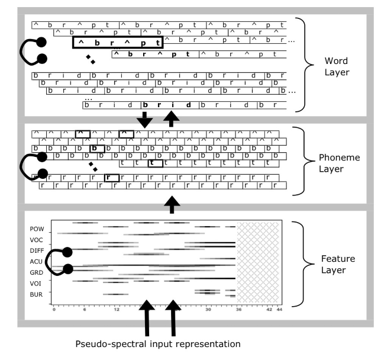
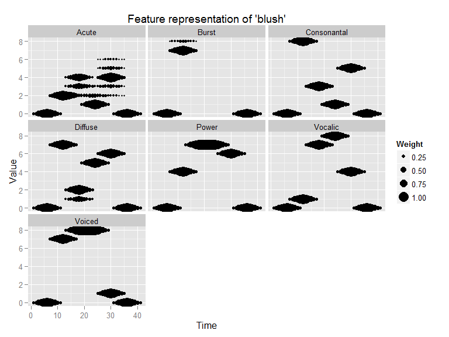
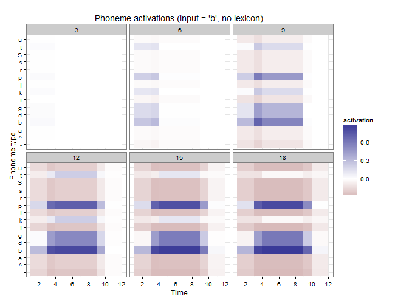
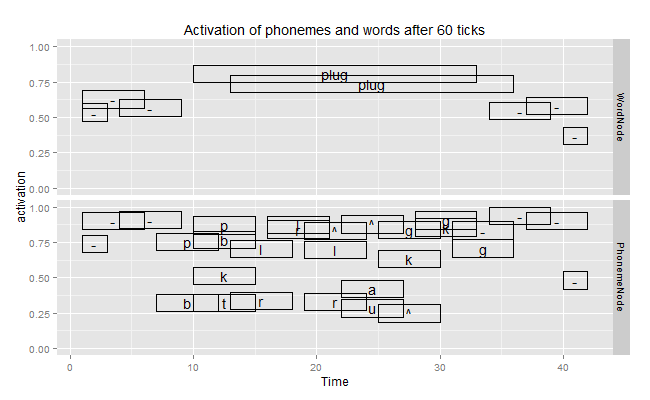
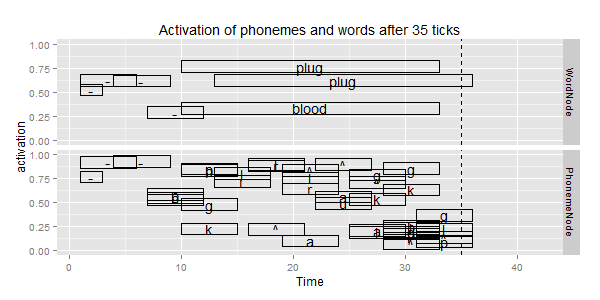
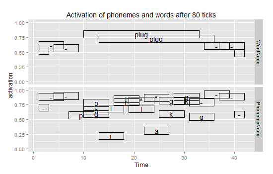

# retrace: An implementation of TRACE in R

Tristan Mahr, December 18, 2014

**Note**: I originally developed this R package and wrote this report as a final project in a psychology course on parallel distributed processing.

Abstract
--------

The TRACE model (McClelland & Elman, 1986) applies a connectionist architecture to the problem of recognizing words in a stream of speech. The model has proven very successful, and it's still relevant 28 years later. In this report, I describe and demonstrate `retrace`, an implementation of the TRACE model written in the R programming language. I begin by discussing why word recognition is an interesting problem and how two different TRACE models have tackled this problem. After a high-level overview of the model's architecture, I discuss the model from the ground-up. First, I describe the mock-speech that acts as the input into the model. Next, I describe nodes as bundles of data that pass messages back and forth. I demonstrate how activation propagates using this simple example. Finally, I provide three demonstrations of the model's behavior when on some speech input, showing 1) that feature values activate phoneme units, 2) that phoneme units activate word units, 3) that top-down word-to-phoneme pathways allows the network to interpret ambiguous speech sounds (the Ganong effect).

Word Recognition
----------------

Poor Taylor Swift. Everyone [keeps mishearing](http://nymag.com/scienceofus/2014/11/why-you-keep-mishearing-that-taylor-swift-lyric.html) her recent single, "Blank Space". The lyrics read "long list of ex-lovers", but we just hear "lonely Starbucks lovers". Swift's misheard lyrics are a clear example of how word recognition is an interesting problem.

Fluent speech comes in a continuous stream of overlapping sounds. There is no punctuation. Sounds vary tremendously based on word position, neighboring sounds, and prosodic environment--not to mention that speakers vary or that we have perceive speech in noisy environments (and during pop songs). What's a speaker to do in the face of such variability? What's an *artificial neural network* to do?

How do we recover a linguistic signal buried in all that variability? In the first exposition of a TRACE-like model, Elman and McClelland (1986) offer one strategy based on a bottom-up approach:

> The 'lack-of-invariance problem' is not a problem at all for human listeners. It is precisely the variability in the signal which permits listeners to understand speech in a variety of contexts, spoken by a variety of speakers. Instead of searching for invariance in the signal, we think it makes more sense to try to understand how it is that listeners deal with the variability which is there" (p.360).

In this model, acoustic feature detectors activate phoneme representations which in turn activate lexical representations. Rather than trying to pluck out perceptual invariants in the signal, the system permits a many-to-one mapping between feature patterns and phonemes. That is, different features patterns can activate the same phoneme---which is appropriate because phonemes vary contextually. To use one of their examples, the /b/ sounds in *ball* and *crib* are acoustically different, but recognized as the same sound. (p.367). Of course, this property of speech cuts both ways, as two acoustically similar tokens can be perceived as categorically distinct sounds.

The TRACE 1.0 model argues that feature-rich representations can support word recognition by turning the lack-of-invariance problem on its head. Such an approach is powerful but ultimately insufficient. Some top-down pressure is necessary to prevent "recognize speech" from being wrongly parsed as the improbable "wreck a nice beach". The authors admit as much and foreshadow their exploration of the top-down effects: "In a forthcoming paper, we show how the simulated speech version of the TRACE model can identify words and use word-level activations to bias phoneme-level activations" (p.379). They are referring, of course, to TRACE 2.0 (McClelland and Elman, 1986)--this is the model that is most commonly referred to as *the* TRACE model, and it's the focus of this report.

Both TRACE models use similar architectures: Speech enters the model in successive time slices. In each time slice, a bank of feature detectors responds to the features in the signal. These feature detectors, when activated by the input, excite compatible phoneme nodes which in turn excite compatible word units. Both models rely on principles of interactive activation: Compatible units reciprocally excite one another, and incompatible units reciprocally inhibit each other.

Where these two models differ is in their research questions and the implementation details needed to answer those questions. The TRACE 1.0 model bases its feature representations on real acoustic measurements in order to offer a psychologically plausible solution to a difficult engineering problem. The TRACE 2.0 model abstracts away from the acoustic details, using "mock-speech" and mock features. This model has been tremendously successful, and it's still relevant and regularly cited today---thanks to the finding that TRACE simulations provide a close approximation of looking patterns in some eye-tracking tasks (Allopenna, Magnuson, & Tanenhaus, 1998).

Although this report is focused on the second TRACE model (and the more tractable mock-speech inputs it interpret), both TRACE models are concerned with the integration of acoustic cues over time during speech perception and word recognition. It is the interaction of both kinds of information---top-down and bottom-up channels, each operating on different time scales---that makes word recognition such an interesting problem.

High-level description of the TRACE architecture
------------------------------------------------

The TRACE model is simple schematically---just *three* layers of units---but it's massive in scale. A simple simulation will involve thousands of paths between nodes. I will start with a basic overview:

-   **Problem**: Recognize sounds and word (from a pool of competing alternatives) from an acoustic signal.
-   **Input**: A mock-speech spectrogram. The input signal represents acoustic features in equally sized chunks of time. Each time slice contains values for different feature spectra (voicing, power, etc.). The input arrives in the model one slice at time.
-   **Feature Detectors**: For each feature spectrum and in each time slice, there's a bank of nodes that responds to the values of that feature in the input signal. This bank forms a *feature detector*. The nodes in the detector compete with each other, so there are mutually inhibitory connections among the nodes in a feature detector. (Only nodes within the same feature detector inhibit each other.)
-   **Feature-to-Phoneme Connections**: Phoneme units span over multiple time slices and hence over multiple feature detectors. Excitatory connections run from the feature nodes to compatible phoneme units. These connections allow the model to abstract away from fine-grained input data to a coarser phoneme-level interpretation of the input signal.
-   **Phoneme Layer**: Phoneme units are repeated and interleaved over the course of input signal. For example, there is a /p/ unit for each of the time-slice intervals 1--3, 1--6, 4--9, 7--12, 10--16, 13--18, etc.
-   **Phoneme-to-Phoneme Connections**: Phonemes units compete with each other if they overlap in time, and inhibitory connections run between competing phonemes. The strength of the inhibitory connection is proportional to the degree overlap between the phonemes. Phonemes that fully overlap are have strong inhibitory connections, whereas phonemes that partially overlap have a weaker inhibitory connection.
-   **Word Layer**: Word units span the width their constituent phonemes, so that a word with four phonemes spans over just as many time slices as four successive phonemes. Like phoneme units, they are repeated and interleaved over the course of the signal.
-   **Phoneme-to-Word, Word-to-Phoneme Connections**: A phoneme unit excites a word unit if 1) it overlaps in time with the word and 2) the word contains the phoneme. A word unit also excites phoneme units under the same conditions. (Note that this word-to-phoneme is the only top-down pathway in the model architecture, despite some descriptions of TRACE.)
-   **Word-to-Word Connections:** Word units compete with each other if they overlap in time, just as phonemes do. Inhibitory connections extend between competing word units, and the strength of the inhibitory connection increases as the overlap between competing units increases.
-   **Computation Summary**: Mock speech input arrives in successive time slices. Feature detectors respond to the feature values in each slice. The feature detectors excite phonemes when the feature-value is compatible with that phoneme. Phonemes in turn activate compatible word units and word units reciprocally reinforce phoneme units. Competing units in each layer of units compete with each other and inhibit one another. The network processes the input one slice at time. The network continues to run for some number of processing cycles after the input has finished, so the nodes can continue to excite, inhibit and reinforce each other. At each processing cycle, the model's interpretation of the input signal is determined by the feature, phoneme and word units with the strongest activation values at various points in time.

Below is a schematic of the network structure, created for the jTRACE implementation (Strauss, Harris, & Magnuson, 2007). Arrows between layers represent excitatory pathways; the looped edge in each layer represents that competing nodes are mutually inhibitory within each layer.



Note that phoneme and word units are repeated and interleaved in those layers. The word layer in the figure shows the word units for two lexical items---*abrupt* and *breed*---but these words are repeated over several overlapping sub-layers. These layers extend horizontally to match the temporal length of the input signal, so longer streams require more phoneme and word units. These expanding layers cause the network to grow in very large in scale.

Input Representation
--------------------

Model input is an idealized kind of acoustic signal. Words are made up of phonemes, phonemes are made up of acoustic features spread out over time, and phonemes overlap with each other. The signal fed into the model consists are the values of the features at different slices of time.

### Features

There are seven different feature types: Power, Acute, Diffuse, Consonantal, Vocalic, Voiced, and Burst. (The TRACE 1.0 model defines a similar set of features in terms of measurable acoustic properties of the speech signal, so these features are perceptually plausible.) There are eight possible values for these features, plus a special zero value used to represent silence. We interpret the features as perceptual continua, and we interpret the eight values within each feature as octiles along that continuum. Consider the Vocalic Feature. We suppose that this feature reflects some perceptual continuum (having to do with the resonance of a sound), so the feature values Vocalic1 through Vocalic8 carve up that continuum into eight receptive fields. The highly resonant sounds in the input (namely, vowels) correspond with higher feature values along this continuum.

### Features over Time

Because sounds overlap with each other, the feature values in the input also overlap with each other. The model captures this property of speech by spreading out the feature values of each sound over 11 time slices. For example, in a fully voiced sound, the Voiced feature will have an extreme value on that continuum, Voiced8. The Voiced8 feature-value is spread over 11 time slices. The magnitude of the Voiced8 feature-value will rise over five slices, reach its peak value, and decrease over another five slices. In terms of percentage-of-peak energy, the 11 values for the value are as follows: [17%, 33%, 50%, 67%, 83%, 100%, 83%, 67%, 5%, 33%, 17%].

These graded, temporally distributed feature values allow sounds in the input signal to overlap with each other. Suppose we have two sounds /t/ and /a/. The feature values of /t/ are spread over 11 time slices with its peak feature magnitudes landing on the time slice 6. Once the features of /t/ begin to decrease on slice 7, the features of /a/ begin to increase simultaneously. /a/ achieves its peak feature values on slice 12. These overlapping feature gradients are sketched below:

| Time | 1   | 2   | 3   | 4   | 5   | 6    | 7   | 8   | 9   | 10  | 11  | 12   | 13  | 14  | 15  | 16  | 17  |
|------|-----|-----|-----|-----|-----|------|-----|-----|-----|-----|-----|------|-----|-----|-----|-----|-----|
| /t/  | 17% | 33% | 50% | 67% | 83% | 100% | 83% | 66% | 50% | 33% | 17% |      |     |     |     |     |     |
| /a/  |     |     |     |     |     |      | 17% | 33% | 50% | 67% | 83% | 100% | 83% | 66% | 50% | 33% | 17% |

Although each sound has feature information distributed over 11 time slices, the two sounds together only take up 17 time slices. This representational scheme provides the model with an idealized form of coarticulation because the temporal-spectral of each sound is conditioned by its neighboring sounds.

### Visual Example of Model Input

Let's look at an example of the model's pseudo-spectral representation of the speech signal. Below is the input form of "…blush…". I noted in passing that silence is modeled with a special zero feature value. Words fed into the model begin and end with silence, so the feature values below reflect six sound units /-bl^S-/. Each facet in the plot corresponds to a different acoustic feature, the y axis reflects the 8 different regions along the feature continua, and the x axis is time in the signal, and the size of point reflects the magnitude of the feature value. The silence features are obvious: They are the only values that occur "off" the continua at y = 0, and they occur at the beginning and end of the word. The diamond shape of the feature magnitudes for the silences reflect how features rise from nothing, hit their peak, and fall back to zero.



More interestingly, consider the Voiced feature. Both the /l/ and the /^/ in the center of the word are fully voiced. These sounds are adjacent and overlapping. The decrease values of Voiced8 in /l/ co-occur with the rising values in /^/. These values are complementary so that the feature reaches 100% intensity over several time slices.

In acoustic phonetics, the most common way to visualize speech is with a spectrogram in which the signal is drawn with time on the x axis, frequency on the y axis and intensity represented on a z axis. Note that these feature representations are also three-dimensional: time on the x axis, feature degree on the y axis, and magnitude or intensity in the z (size) axis. In this respect, the model represents speech using an idealized but plausible spectro-temporal representation.

Implementation overview
-----------------------

At this point, we're ready to look at `retrace`, my implementation of TRACE in the R programming language. We begin with some simple communication between nodes.

### Nodes

Nodes are implemented using a message-passing object-oriented paradigm. What this means that is that the nodes of the network are just capsules of data plus methods for manipulating that data. Each node knows about its current activation level, can collect input from other nodes and can update its current activation state. More explicitly, each node has following attributes (among other convenient attributes like a label or a history of activation values).

| **Attribute**                                 | **Description**                                                                                              |
|-----------------------------------------------|--------------------------------------------------------------------------------------------------------------|
| `timeslices`, `t_start`, `t_end`              | Where in the speech time-stream the node occurs.                                                             |
| `edges_in`                                    | A list of incoming edges. Each edge is just a weight and a reference to the sending node.                    |
| `act_min`, `act_max`, `act_rest`, `act_decay` | Activation parameters. Activation bounds are [-.3, 1] with a resting value of 0 and default decay rate of 0. |
| `tick`                                        | Number previous updates.                                                                                     |
| `cache`                                       | Most recent input value.                                                                                     |
| `activation`                                  | Current level of activation                                                                                  |

Time is represented spatially in the network, so the `timeslices` attributes describe the spatial arrangement of the node and allows us to determine whether nodes overlap in time.

The following methods describe the basic operations of a node:

| **Methods**            | **Description**                                     |
|------------------------|-----------------------------------------------------|
| `attach_input(edge)`   | Add an incoming edge                                |
| `send_activation()`    | Return the activation (when asked by another node)  |
| `receive()`            | Collect input from incoming edge                    |
| `compute_activation()` | McClelland and Rumelhart (1981) activation function |
| `uptick()`             | Update the activation of the node.                  |

The value returned by `send_activation` is not the same as the value of the activation attribute. Nodes can only send positive activations value: A strongly inhibited node (with negative activation) can only send an activation of 0. In other words, only positively activated units can influence other nodes.

### Input Nodes

The speech enters the network through *input nodes*. These nodes only fire when their internal clock (`tick`) syncs up with their temporal location. This constraint means that these nodes can send messages on a schedule. (If these nodes were constantly active, they essentially would be bias nodes.) An input node emits an activation value of 1 when it's active, and this value is scaled by the connection weights between the input node and the receiving nodes. The model's mock-speech input, as described and visualized above, is represented in the connections weights between input nodes and feature detectors. The points in column *t* of those feature plots describes the connections from the input node to feature detectors at time *t*.

### Simple Message-Passing and Zeno's Activation Function

Now that I've described nodes and how scheduled input activation works in the network, I can provide a simple demonstration of the McClelland and Rumelhart (1981) activation function. Nodes have activation bounds of -.3 and 1 with a resting activation of 0. Activation values can also decay by some rate. Decay is essentially an inhibitory signal that a node sends itself that allows the node to gradually return towards its resting activation in the absence of other input. When a node collects input values from incoming connections, those values are summed together. The net input describes how much the node should shift its activation towards the upper or lower activation bounds.

Suppose for example that node *n* receives a positive input of .25. Let *d* be the difference between the node's current activation value and its maximum activation value. Under the McClelland and Rumelhart (1981) activation function, the activation of *n* increases by .25 \* *d*. When the net input for a node is clamped onto to .5, then we essentially have Zeno's paradox. On each uptick, the node moves half the distance towards its activation limit. Therefore, this activation function has a sigmoidal property: A node is most sensitive to input when at rest and becomes less sensitive to input as its activation increases.

Now we can demonstrate with a simple example of how input nodes, this activation function, and activation decay work together in my implementation. In the code below I construct an input node that is scheduled to be active for 5 ticks. This node connects to two other nodes with a weight of .5, so we will expect to see Zeno-like growth in activation over 5 ticks. One of these receiving nodes also has decay rate of .1. This node will grow more slowly compared to the other receiving node, and its activation will begin to decline once the input node becomes inactive. These behaviors are also illustrated in the accompanying plot.

``` r
library("retrace")  
library("ggplot2")

# The input node will be active from time 1 to 5
i1 <- InputNode$new(timeslices = 1:5)
f1 <- Node$new(timeslices = 1)
f2 <- Node$new(timeslices = 1)

# Allow f2 to decay
f2$act_decay <- .1

# Give the nodes meaningful labels for plot
i1$tag <- "input"
f1$tag <- "no_decay"
f2$tag <- "with_decay"

# One-way connection with weight of .5
connect_onto(i1, f1, weight = .5)
connect_onto(i1, f2, weight = .5)

# Combine to a miniature network and run for 10 cycles
pool <- c(i1, f1, f2)
pool <- uptick(pool, n_ticks = 10)

# Visualize the activation history
act_history <- get_history(pool)
p <- ggplot(act_history) + 
  aes(x = tick, y = activation, color = tag) +
  geom_line() + 
  facet_grid(NodeClass ~ .) + 
  scale_x_continuous(breaks = seq(0, 10, by = 2)) + 
  ggtitle("Activation levels for one input and two output nodes")
print(p)
```


### Inhibition

The final piece of functionality we need to account for is mutual inhibition. Inhibition is implemented in a network as a negative weight between two nodes. Since input values are summed together when collected, an inhibitory signal decreases the net input into a node. The plot below illustrates the same example as above, except with a mutual inhibitory weight of .2 runs between the two nodes receiving the input. As we can see, the activations of the nodes grow less quickly since they are competing with each other. We also see that the decay of the one node is increased by the inhibitory connection.


Outwards and Upwards
--------------------

Thus far, I have described the input representation system (feature values spread out in time), how input enters into the network (through scheduled activations from input nodes to feature nodes), and how nodes can excite and inhibit one another. It's a fairly simple system on a local level. In fact, most of the complexity (and lines of code) in my implementation centers around building and connecting nodes together. I will omit these implementation details, except to say that the connections and network assembly functions adhere to the rules described below:

-   Some nodes are *compatible*.
    -   Feature nodes are compatible with phonemes that have the same feature type and value. The feature "Acute2" is compatible with /p/ and /b/ for example.
    -   Phoneme nodes are compatible with words containing that phoneme. /p/ is compatible with "plug", "plus", etc.
    -   Word nodes with compatible with the phonemes found in that word. "plug" is compatible with /p,l,^,g/.
-   Nodes are *incompatible* if they represent competing interpretations of the speech signal.
    -   Feature nodes are incompatible with all other nodes of the same feature type. Voice0 is incompatible with all other voice nodes (Voice1, Voice2, ..., Voice8).
    -   Phonemes are incompatible with each other.
    -   Words are incompatible with each other.
-   Two nodes *overlap* if the time-slices spanned by the two nodes overlap.
    -   Feature nodes span just 1 time slices, so they only overlap nodes in the same time slice.
    -   Phonemes span 6 time slices.
    -   Words span the width of the constituent phonemes. A word with 4 phonemes spans 4 x 6 = 24 time slices.
-   Overlapping compatible nodes excite one another.
-   Overlapping incompatible nodes inhibit one another.
    -   Inhibitory connections are proportional to the amount of overlap between the two nodes.

TRACE networks are massive in scale, as the following demos show. This scale makes it difficult to visualize network behavior (and difficult to confirm that the implementation is working as expected). For this reason, we will ask if the network behaves as expected under specific conditions.

### Feature-to-Phoneme and Phoneme-to-Phoneme Connections

For this demo, there is just one phoneme in the signal---/bs---and the lexicon consists of only the silence character "-". We want to confirm that the network interprets the input as /b/. We expect a strong activation for /b/ and partial activation of similar phonemes (/p,d/).

``` r
# Not run during vignette rendering (too slow)
just_b <- create_input_matrix("b", silence = FALSE)
silence <- data.frame(Word = "-", Sounds = "-", stringsAsFactors = FALSE)
b_trace <- initialize_network(just_b, lexicon = silence)
b_trace <- uptick(b_trace, 20)
```

We visualize the network using a heat map to see when we type of phoneme becomes active. Here, each panel corresponds to a different point in the network's history.



As expected, /b/ becomes the most activated phoneme followed closely by /p/ then the other voiced stops /d,g/. Interestingly, /t/ and /k/ become partially activated after 9 ticks but inhibition pushes these nodes back to resting level by tick 18.

### Phoneme-to-Word and Word-to-Word Connections

Now, let's provide a lexicon and full word for the model to process. We present the string "…plug…" to the network. For this example, the lexicon consists of *plug*, *plus*, *blush*, *blood*.

``` r
# Not run during vignette rendering (too slow)
lexicon <- read.csv("data/blood_lex.csv", stringsAsFactors = FALSE)
plug <- create_input_matrix("pl^g")
plug_trace <- initialize_network(plug, lexicon)
plug_trace <- uptick(plug_trace, 60)
```

We expect that the word node for "plug" that spans most of the input will have the strongest activation. We also expect the silence words "-" to be active at the beginning and end of the input stream.



The plot above shows the activation levels of phonemes and word units in this network. (Negative activations are omitted.) The network behaves as expect.

### Word-to-Phoneme Connections

Finally, we examine the top-down, lexical influences on phoneme perception. Let X be an ambiguous phoneme between /p/ and /b/. The plot below shows the feature values of the /p/, X, and /b/. Note that the Voiced cue is unavailable for X and the Burst feature is compatible with both /b/ and /p/.

    #> Joining by: "Time"


We wish to replicate the Ganong effect in which top-down lexical pressures provide an interpretation for an ambiguous phoneme. Specifically, we are going to construct our network with the same lexicon as above "plug", "plus", "blush", and "blood" lexicon. We present the network with the signal "…Xlug…". This input is ambiguous until the /g/ favors "plug". Then we expect the top-down connections from "plug" to cause the network to favor /p/ for /b/.

As expected, the initial consonant is ambiguous. At 25 ticks:


After 35 ticks, *plug* emerges as the most plausible interpretation, but the initial sound is still ambiguous.



After 80 ticks, the initial /b,p/ units have diverged:



These plots confirm our expectations that top down influence will resolve an ambiguous phoneme.

Summary
-------

In this report, I reviewed the TRACE model of word recognition, as well as demonstrate some features from my implementation of this network. By re-implementing the model, I became deeply familiar with the model and its limitations. For instance, in this model all sounds are exactly the same duration---am idealized representation of speech. Also, the fact that the model copies its entire phoneme inventory and lexicon every three time steps makes these networks unwieldy in scale and raise questions of psychological plausibility. Perhaps, a more elegant and accurate representation of the word recognition would be a fully recurrent network in which time is not represented spatially. My next step with this implementation, besides completing it, will be to predict performance on eye-tracking experiments using TRACE simulations.

Addendum: Implementation Progress and Notes
-------------------------------------------

**Why R?** I wrote developed my implementation of TRACE in the R programming language using a reference-based object system. This strategy allowed my nodes to be independent capsules of data that can send messages to one another. Such an approach is not really optimized or idiomatic in R, so my implementation is very slow. Nonetheless, I chose R because 1) I know it really well and 2) I would have used R to generate input data and analyze network output from any other approach (cut out the middle person). Moreover, R's high-level features and interactive environment allowed me to create a working implementation of TRACE in 10 days.

**What's missing?** My implementation covers about a third of the original TRACE 2.0 article. (Granted, that third is the really hard part.) In order to fully implement TRACE, I have to replicate the other examples given in that article. I will implement these as demos to go with the package. I also have to implement a Luce probability function. Most of the visualizations from TRACE simulations are growth curves of Luce probability values.

**Why re-implement TRACE again?** Because I want to learn how TRACE works. Implementing the model allowed me to prove to myself how the model works. Also, I built an independent implementation, working only from the specifications given in the 1986 article. The only time I referred to the original C source code was to check the feature definitions of the phonemes. By replicating effects in the original article, I've independently reproduced their results.

**Where is it?** My code lives on the social-coding/version-control platform Github <https://github.com/tjmahr/retrace>. Once it's in a more completed state, I will distribute it as an R package.

References
----------

Allopenna, P. D., Magnuson, J. S., & Tanenhaus, M. K. (1998). Tracking the time course of spoken word recognition using eye movements: Evidence for continuous mapping models. *Journal of memory and language*, *38*(4), 419--439.

Elman, J. L., & McClelland, J. L. (1986). Exploiting lawful variability in the speech wave. In J. S. Perkell & D. H. Klatt (Eds.), *Invariance and variability of speech processes* (pp. 360--385). Hillsdale, NJ: Lawrence Erlbaum Associates, Inc.

McClelland, J. L., & Elman, J. L. (1986). The TRACE model of speech perception. *Cognitive psychology*, *18*(1), 1--86.

McClelland, J. L., & Rumelhart, D. E. (1981). An interactive activation model of context effects in letter perception: I. An account of basic findings.*Psychological review*, *88*(5), 375.

Strauss, T. J., Harris, H. D., & Magnuson, J. S. (2007). jTRACE: A reimplementation and extension of the TRACE model of speech perception and spoken word recognition. *Behavior Research Methods*, *39*(1), 19--30.
